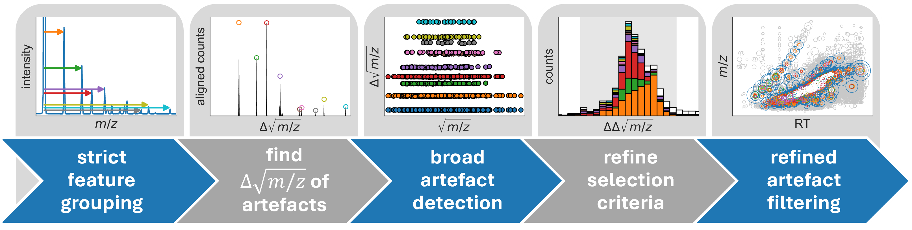

# filter4TOFringing

Detector oscillations are intrinsic artefacts in time-of-flight mass spectrometry (TOF-MS) data and can produce spurious signals that impede data analysis. This Streamlit application uses a data-driven workflow to identify and remove these artefacts, thereby improving data quality.

## Features

- **Interactive demo**: Explore the filtering algorithm with pre-loaded data
- **Custom data import**: Upload your own TOF-MS feature table (.csv or .xlsx format)
- **Multi-stage filtering**:
    - Strict artefact detection to find Δ√(m/z) values
    - Broad artefact detection for parameter refinement
    - Final artefact filtering with refined parameters
- **Real-time visualization**: Interactive plots showing raw data, detected artefacts, and filtering results
- **Configurable parameters**: Adjust RT tolerance, drift time/CCS tolerance, intensity thresholds, and correlation requirements
- **Export functionality**: Download filtered feature tables with artefact annotations

## How It Works

The workflow relies on a five-stage approach:

1. **Strict grouping**: Identify feature pairs using strict co-elution, correlation and intensity criteria
2. **Maxima finding**: Apply Gaussian convolution to find recurring Δ√(m/z) values representing ringing artefacts
3. **Broad detection**: Use Δ√(m/z) values and broadened criteria to prevent fasle-negatives
4. **Criteria refinement**: Refine selection criteria to minimize false-positive annotations
5. **Refined filtering**: Re-processes data with refined parameters to accurately annotate and filter artefacts

## Data Format

Input data should be in CSV or Excel format with:
- Required column: `m/z`
- Required column(s): peak areas or intensities across sample(s)
- Optional columns: `RT` (retention time), `DT` (drift time) or `CCS`

## Privacy & Security

**Important**: This application is hosted on Streamlit Community Cloud. Uploaded files are processed in-memory and are not stored permanently. Do not upload sensitive, proprietary, or HIPAA-regulated data.

## Citation

If you use this tool in your research, please cite:

> K.J. Houthuijs, K.J. Jobst and F. Béen. Data-Driven Filter for Detector Oscillation Artefacts in Time-of-Flight Mass Spectrometry. _To be submitted._

## Contributing

Contributions are welcome! Please feel free to submit a Pull Request or open an issue for bug reports and feature requests.

## License

MIT License

Copyright (c) 2026 Kas J. Houthuijs

Permission is hereby granted, free of charge, to any person obtaining a copy
of this software and associated documentation files (the "Software"), to deal
in the Software without restriction, including without limitation the rights
to use, copy, modify, merge, publish, distribute, sublicense, and/or sell
copies of the Software, and to permit persons to whom the Software is
furnished to do so, subject to the following conditions:

The above copyright notice and this permission notice shall be included in all
copies or substantial portions of the Software.

THE SOFTWARE IS PROVIDED "AS IS", WITHOUT WARRANTY OF ANY KIND, EXPRESS OR
IMPLIED, INCLUDING BUT NOT LIMITED TO THE WARRANTIES OF MERCHANTABILITY,
FITNESS FOR A PARTICULAR PURPOSE AND NONINFRINGEMENT. IN NO EVENT SHALL THE
AUTHORS OR COPYRIGHT HOLDERS BE LIABLE FOR ANY CLAIM, DAMAGES OR OTHER
LIABILITY, WHETHER IN AN ACTION OF CONTRACT, TORT OR OTHERWISE, ARISING FROM,
OUT OF OR IN CONNECTION WITH THE SOFTWARE OR THE USE OR OTHER DEALINGS IN THE
SOFTWARE.

## Contact

For questions or support, please open an issue on the GitHub repository or contact the corresponding author at k.j.houthijs@vu.nl.